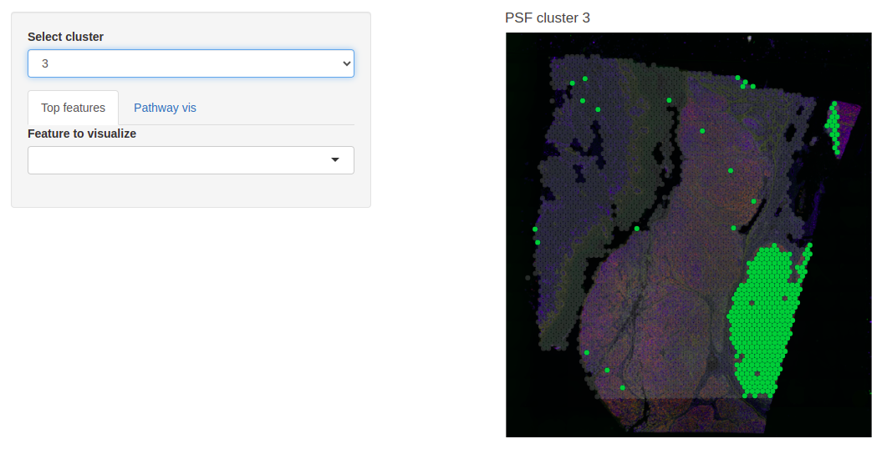
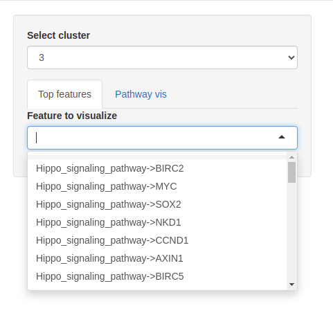
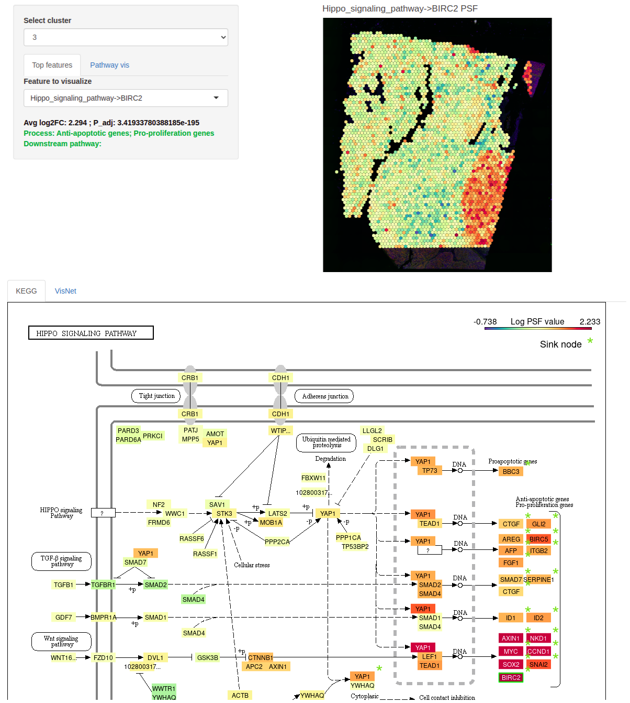
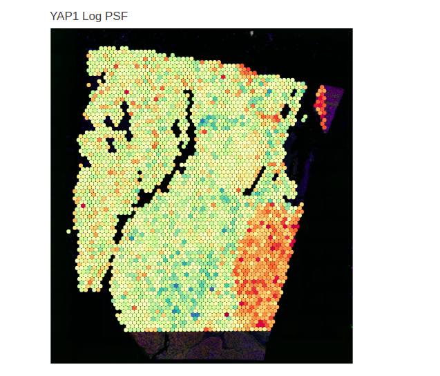
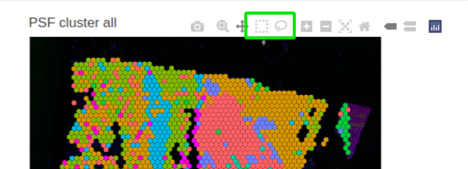
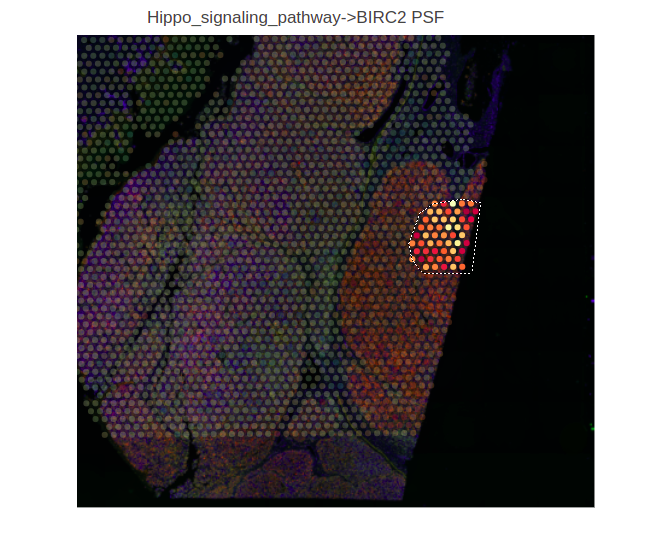

# Use Case: Exploring Spatial Transcriptomics in Human Melanoma

In this use case, we explore the spatial transcriptomics dataset of human melanoma from 10x Genomics public datasets. This example demonstrates the initial data processing, pathway analysis, and interactive data exploration with the PSF Spatial Browser app. The following guide provides a step by step tutorial to analyze spatial transcriptomics data and run the PSF Spatial Browser locally. A demo version of the app for this dataset is available at [this link](https://apps.armlifebank.am/PSF_spatial_browser/).

## Step 1: Data Preparation

First, download the desired spatial dataset from the 10x Genomics Data Portal and create a spatial dataset directory.

Next, clone the GitHub repository containing all necessary scripts and functions for spatial transcriptomics data analysis:

``` bash
git clone https://github.com/hakobyansiras/PSF_spatial.git
```

Install all the required R packages:

``` r
remotes::install_github("hakobyansiras/psf")
if (!require("BiocManager", quietly = TRUE)) {install.packages("BiocManager")}
BiocManager::install("biomaRt")
install.packages(c("ggplot2", "patchwork", "dplyr", "data.table", "DT", "miniUI", "shiny", "Seurat", "psf", "magick", "shinyjs", "visNetwork", "biomaRt", "SeuratData"))
```

Then, load the required R functions from the downloaded repository:

``` r
source("Spatial_psf_analysis.R")
source("psf_spatial_browser.R")
```

## Step 2: Load and Prepare the Dataset

Load your spatial dataset using the `Load10X_Spatial()` function:

``` r
spatial_melanoma <- Load10X_Spatial("/data/spacial_melanoma_psf/spatial_data", filename = "CytAssist_FFPE_Human_Skin_Melanoma_filtered_feature_bc_matrix.h5")
```

### Downloading Gene Symbol to Entrez ID Conversion Data

You can download gene symbol to Entrez ID conversion data or use the preloaded version:

``` r
# ensembl = useMart("ensembl",dataset="hsapiens_gene_ensembl")
# gene_symbol_to_entrez <- getBM(attributes=c('entrezgene_id', 'hgnc_symbol'), mart = ensembl)
# gene_symbol_to_entrez <- gene_symbol_to_entrez[which(!is.na(gene_symbol_to_entrez$entrezgene_id)),]
# gene_symbol_to_entrez <- gene_symbol_to_entrez[which(!duplicated(gene_symbol_to_entrez$entrezgene_id)),]
# gene_symbol_to_entrez <- setNames(object = gene_symbol_to_entrez$entrezgene_id, nm = gene_symbol_to_entrez$hgnc_symbol)
load("gene_symbol_to_entrez.RData")
```

Load KEGG signaling pathways:

``` r
load(system.file("extdata", "kegg_curated_40_signalings.RData", package="psf"))
load(system.file("extdata", "kegg_sink_to_process.RData", package="psf"))
```

## Step 3: Run Pathway Analysis

Run pathway analysis using the `spatial_psf_analysis()` function:

``` r
psf_spatial <- spatial_psf_analysis(spatial_obj = spatial_melanoma, pathway_collection = kegg_curated_40_signalings, gene_symbol_to_entrez = gene_symbol_to_entrez, nthreads = 30)
```

## Step 4: Launch the App

Launch the PSF Spatial Browser application:

``` r
run_psf_spatial_browser(psf_spatial_results = psf_spatial)
```

## Step 5: Explore the Results

Once the app launches, you can begin exploring the analysis results interactively.

### Selecting cluster of interest

Cluster 3 in this dataset displays distinct features and appears to be localized in a specific tissue area. Select this cluster using the "Select Cluster" widget. After selecting Cluster 3, the cluster spots are highlighted on the spatial plot.



### Visualizing cluster specific features

When cluster is selected feature selction widget will be updated to include cluster assoicated significant features. To visualize pathway activity of those, select a feature, such as the terminal node BIRC2 in the Hippo signaling pathway. The Hippo pathway is known to regulate organ growth and cell fate.



Afte selecting the feature the pathway network is rendered, with BIRC2 highlighted in green, and color-coded activity values of BIRC2 gene are displayed on the spatial plot.



### Pathway node selection

By examining the color-coded pathway nodes, you can observe the high activity of YAP1 gene. This gene plays a key role in this pathway and is associated with melanoma cell invasion and metastasis. Double-clicking on the nod of YAP1 gene will render its activity on the spatial plot.



The spatial plot reveals that YAP1 activity is elevated in Cluster 3.

### Spot Selection for Averaged Pathway Activity

Select specific spot or group of spots using the box or lasso selection tools to visalize mean activity values of slected pathway.





The selected spots' mean activity is visualized on the pathway network.

### Pathway Visualization Tab

This tab allows you to select a pathway for independent visualization. Selected pathways are color-coded based on the selected cluster or spots. You can choose between PSF activity or gene expression fold change as the mapping value for pathway nodes.

With these steps, you can explore and understand the spatial transcriptomic data comprehensively using the PSF Spatial Browser.
